# Architecture

Visual companion to [`PLAN.md`](PLAN.md). These diagrams describe the **v1 target**, not the current (bootstrap) tree.

## 1. Container

One Compose service on a **Linux host** with `network_mode: host`. `scripts/entrypoint.sh` starts **dnsmasq** (DHCP + TFTP) and **uvicorn** (FastAPI). The web process drops to non-root after bind; dnsmasq keeps `NET_ADMIN` / `NET_RAW` so it can answer DHCP. The container is **not** `privileged: true` unless a later milestone proves it is required.

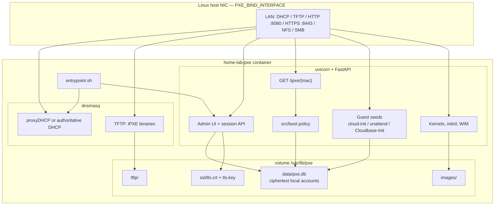

### 1.1 Processes and privileges

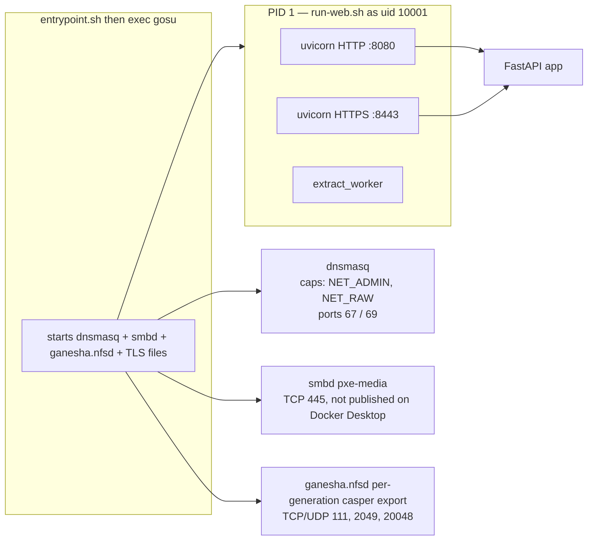

### 1.2 Volumes and env

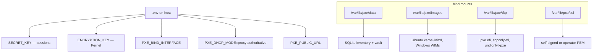

### 1.3 DHCP coexistence

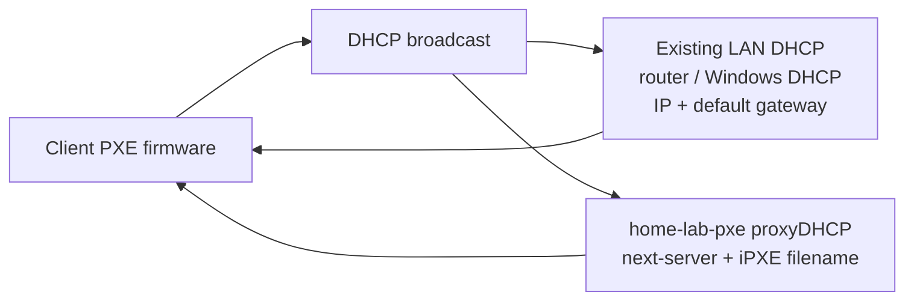

Authoritative mode (`PXE_DHCP_MODE=authoritative`) makes dnsmasq own the address range instead. Default is **proxy** so the home-lab router stays the DHCP server.

When the existing LAN DHCP server must point clients at this box (DHCP disabled here), set option 66 to the host LAN IPv4 and option 67 to `undionly.kpxe` / `ipxe.efi` / `snponly.efi`. Option 60 (`PXEClient`) is required only when that DHCP server and this PXE/TFTP service share the same physical machine. Leave 60/66/67 unset on the other server if this container is already running proxyDHCP.

---

## 2. Boot data plane

Every managed machine is **PXE-first**. “Skip PXE” means **skip the menu**, not “never talk to the server.” Deployed hosts still fetch `/ipxe/{mac}` so a staged job can take the next boot.

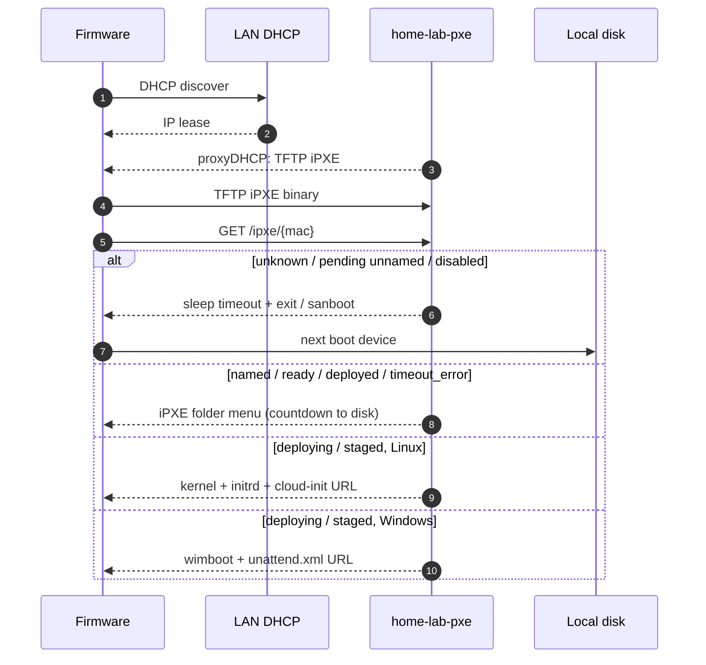

### 2.1 Boot-policy decision

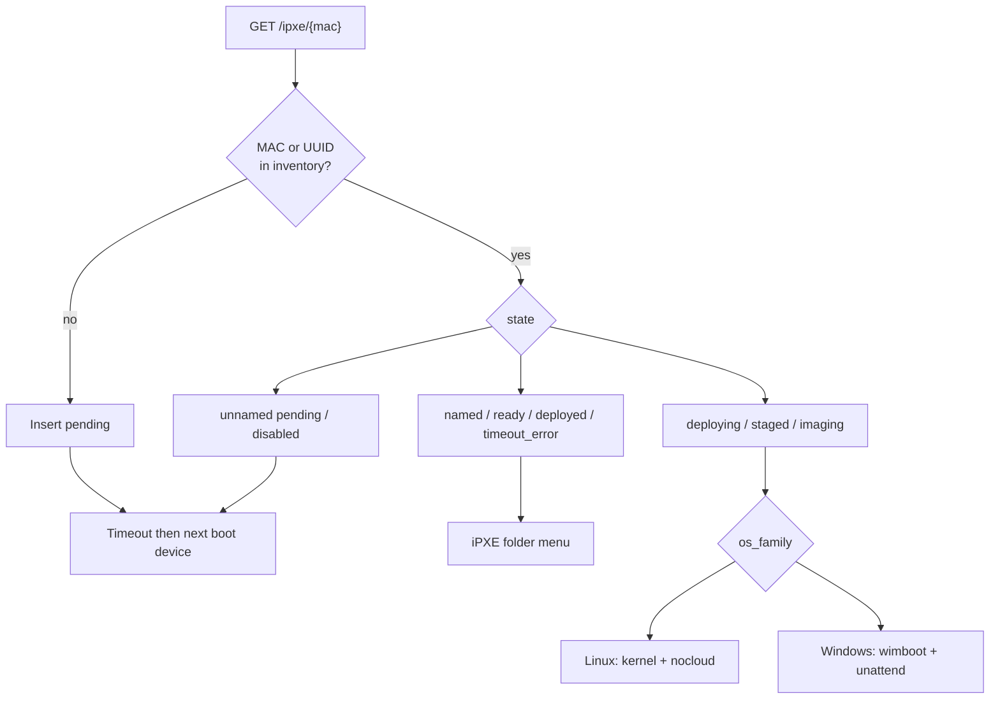

### 2.2 Linux install

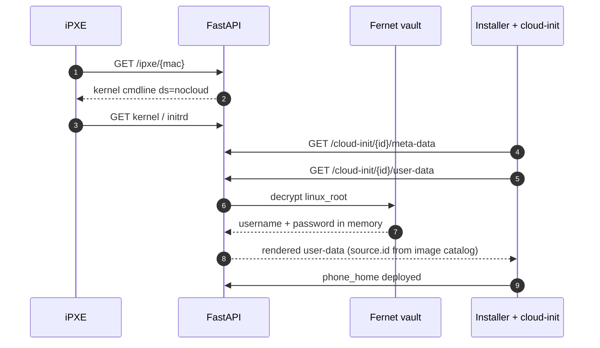

### 2.3 Windows Server install

```mermaid
sequenceDiagram
  autonumber
  participant IPXE as iPXE
  participant API as FastAPI
  participant Vault as Fernet vault
  participant PE as WinPE / Setup
  participant CBI as Cloudbase-Init

  IPXE->>API: GET /ipxe/{mac}
  API-->>IPXE: wimboot + boot.wim / install.wim
  PE->>API: GET /windows/{id}/unattend.xml
  API->>Vault: decrypt windows_administrator
  API-->>PE: unattend.xml (IMAGE NAME/INDEX from catalog; not cached plaintext)
  PE->>CBI: first boot of sysprep’d image
  CBI->>API: GET /cloudbase-init/{id}/
  CBI->>API: callback deployed
```

### 2.4 Machine lifecycle

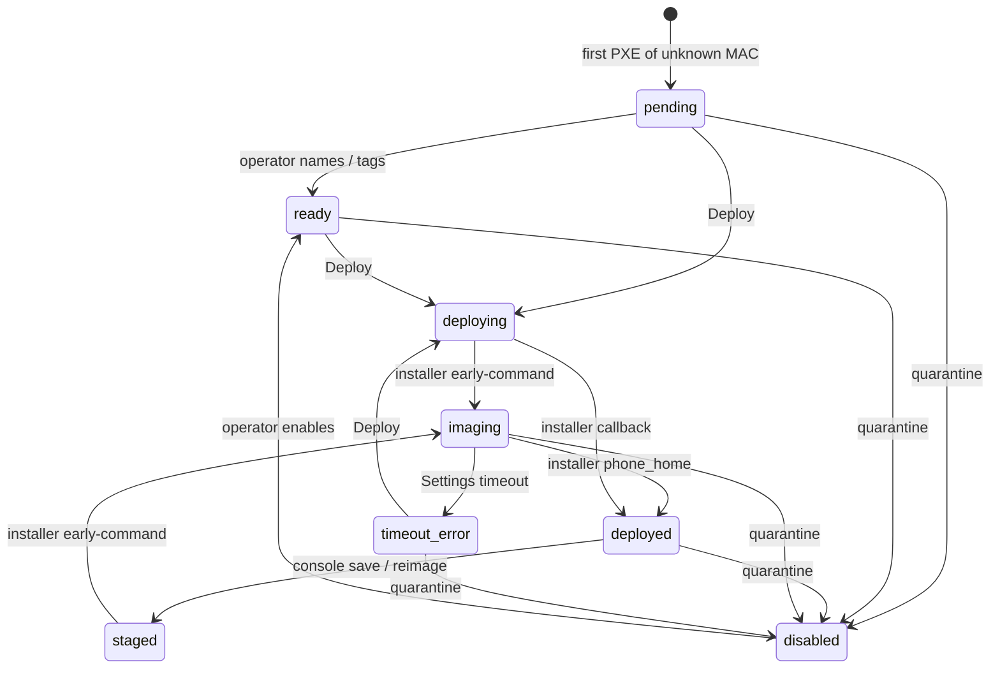

Identity: **MAC primary**, SMBIOS UUID secondary. A known UUID with a new MAC (NIC swap) attaches the MAC and keeps the record. **Timeout Error** is wait-only (no guest-init); the operator Deploys again. The timer is Settings → Machines (default 15 minutes). New machines inherit the Settings default IANA timezone.

---

## 3. Web console

Jinja2 admin UI behind session login. Target information architecture:

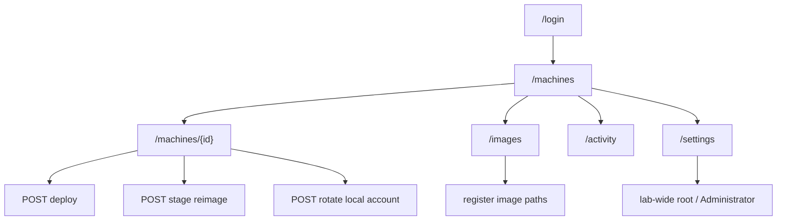

### 3.1 Shell

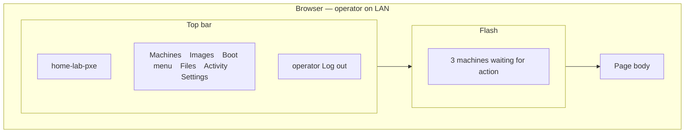

### 3.2 Machines list

Pending rows are visually loud so unknown hardware cannot hide in a deployed fleet.

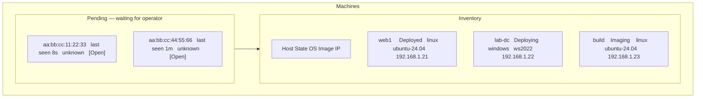

### 3.3 Machine detail

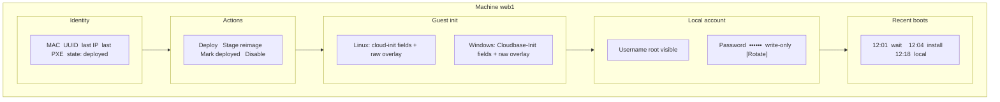

Password fields never round-trip. After save the UI shows **set** vs **not set**, not the secret.

### 3.4 Images and settings

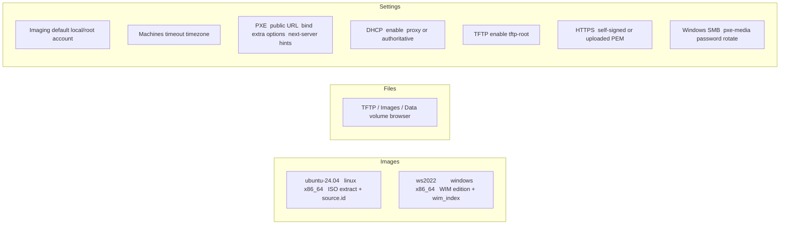

### 3.5 Operator: discover → deploy → later reimage

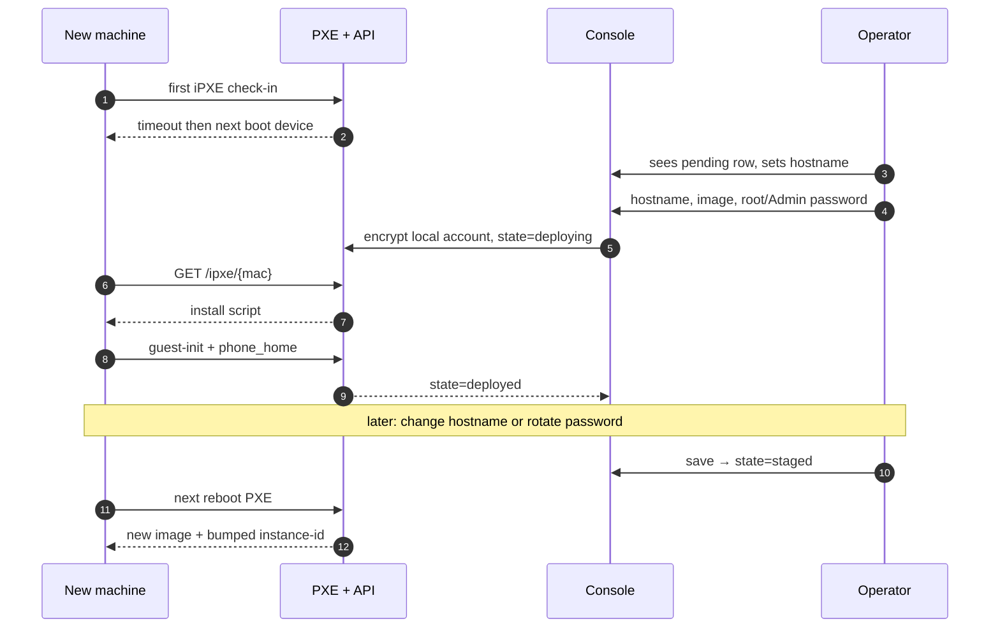

### 3.6 iPXE folder menu (client screen)

Named hosts see folders from the console **Boot menu** page. Operators can reparent a folder (Root is the top of the tree). Unknown and disabled hosts skip the menu.

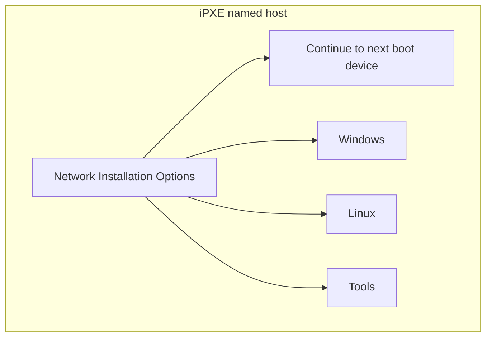

---

## 4. Security architecture

### 4.1 Trust zones

The data plane is **LAN-trust**. Do not publish DHCP, TFTP, or HTTP-boot to the internet. MAC spoofing can impersonate a host; privileged passwords stay out of iPXE so a neighbor cannot read them from the first-stage script.

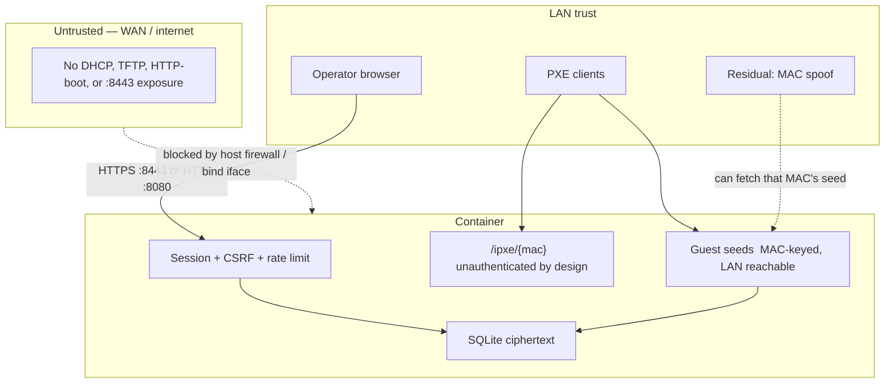

### 4.2 What is authenticated

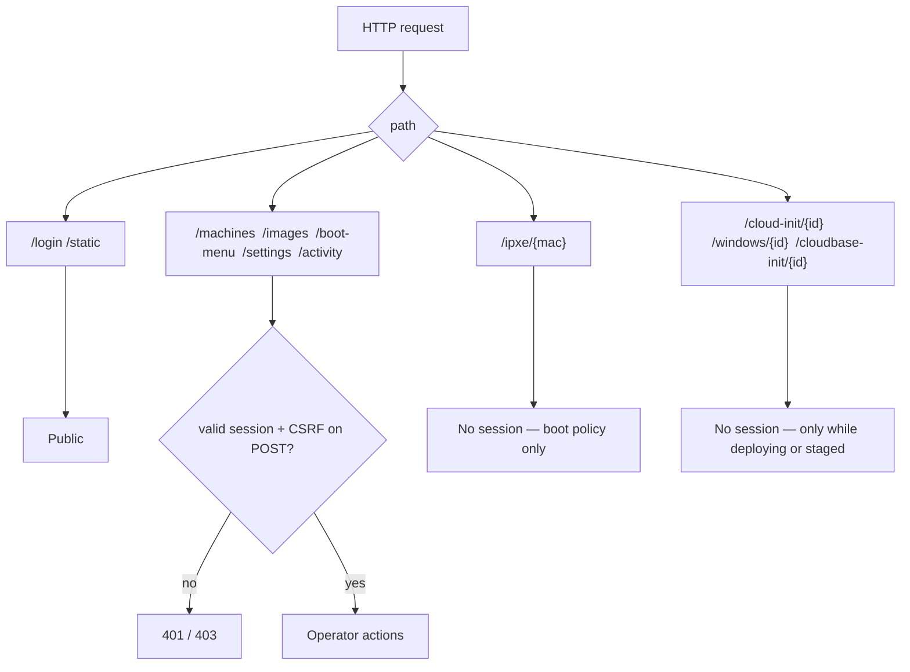

Guest seeds must not require a browser cookie (installers cannot log in). They **must not** appear in iPXE text. Seeds that decrypt the vault are served **only** while the machine is `deploying` or `staged` (404 otherwise). A LAN attacker who spoofs the MAC during that window can still pull that machine’s seed; that is an accepted home-lab residual risk.

### 4.3 Credential vault

Linux **root** and Windows **local Administrator** usernames **and** passwords are Fernet-encrypted. Decrypt only in memory while rendering cloud-init, `unattend.xml`, or Cloudbase-Init user-data.

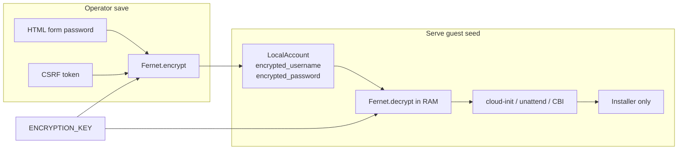

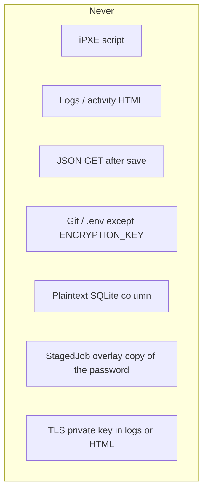

`SECRET_KEY` signs cookies. `ENCRYPTION_KEY` wraps vault rows. Both are required in production. `PXE_ALLOW_INSECURE_DEFAULTS=1` is test-only.

### 4.4 Console request hardening

```mermaid
sequenceDiagram
  autonumber
  participant B as Browser
  participant W as FastAPI
  participant RL as Rate limit
  participant DB as SQLite

  B->>W: GET /login
  W-->>B: CSRF cookie + form
  B->>W: POST /login
  W->>RL: check
  alt too many failures
    RL-->>B: 429
  else ok
    W->>DB: verify user
    W-->>B: session HttpOnly cookie
  end
  B->>W: POST /machines/{id}/deploy
  W->>W: session + CSRF
  W->>DB: write ciphertext + state
  W-->>B: redirect  — password not in response
```

### 4.5 Container hardening

```mermaid
flowchart TB
  subgraph yes["Do"]
    Y1["network_mode: host on Linux"]
    Y2["Bind DHCP to PXE_BIND_INTERFACE"]
    Y3["NET_ADMIN / NET_RAW only"]
    Y4["Non-root uvicorn"]
    Y5["Path-safe joins under PXE_IMAGE_ROOT"]
    Y6["Trivy High/Critical on image"]
  end
  subgraph no["Do not"]
    N1["privileged: true by default"]
    N2["Publish 67/69/8080/8443 to the internet"]
    N3["Log user-data or unattend"]
    N4["OpenAPI / debug in production"]
  end
```

### 4.6 Data model (security-relevant)

```mermaid
erDiagram
  USER ||--o{ SESSION : has
  MACHINE ||--o{ LOCAL_ACCOUNT : has
  MACHINE ||--o{ STAGED_JOB : has
  MACHINE ||--o{ BOOT_EVENT : has
  IMAGE ||--o{ MACHINE : assigned
  SETTINGS ||--o{ LOCAL_ACCOUNT : "lab defaults"

  USER {
    string username
    string password_hash
  }
  MACHINE {
    string mac PK
    string uuid
    string state
    string instance_id
  }
  IMAGE {
    string name
    string os_family
  }
  LOCAL_ACCOUNT {
    string kind
    bytes encrypted_username
    bytes encrypted_password
  }
  STAGED_JOB {
    string guest_overlay
  }
  BOOT_EVENT {
    string script_kind
  }
```

`STAGED_JOB.guest_overlay` holds non-secret fields and template references. It does **not** store a second plaintext password.

---

## 5. Control-plane modules

```mermaid
flowchart LR
  R["src/routes"] --> B["src/boot"]
  R --> C["src/cloudinit"]
  R --> W["src/windows"]
  R --> I["src/inventory"]
  B --> I
  C --> S["src/security Fernet"]
  W --> S
  I --> S
  I --> DB["src/db SQLite"]
```

| Module | Responsibility |
|--------|----------------|
| `src/boot/` | Policy + `#!ipxe` |
| `src/cloudinit/` | Linux nocloud |
| `src/windows/` | `unattend.xml` + Cloudbase-Init |
| `src/inventory/` | Machines, states, `LocalAccount`, boot-menu tree |
| `src/install_sources.py` | Ubuntu YAML / Windows WIM install-source catalogs |
| `src/security.py` | Fernet, hashing, cookie flags |

Implementation milestones stay in [`PLAN.md`](PLAN.md).
