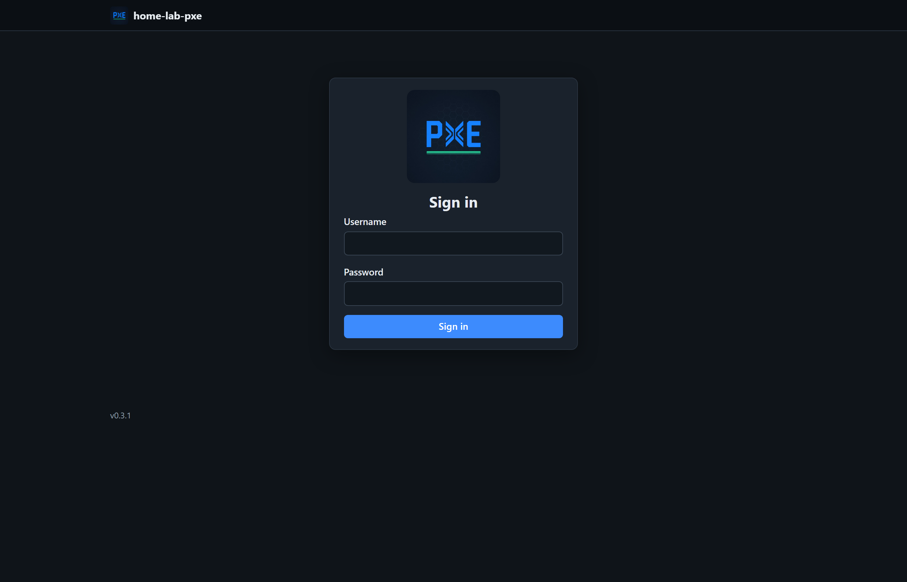
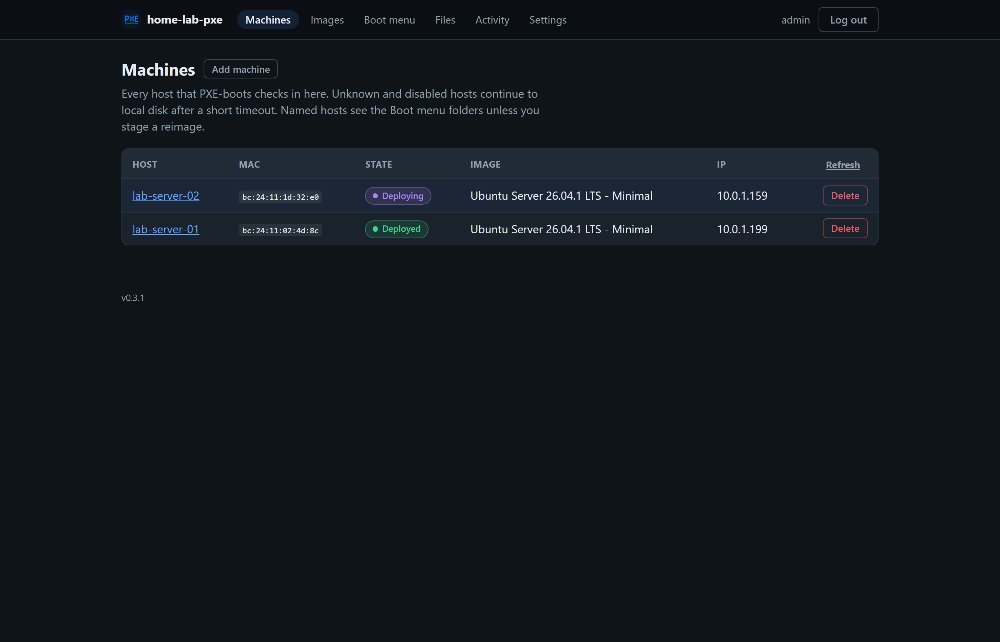
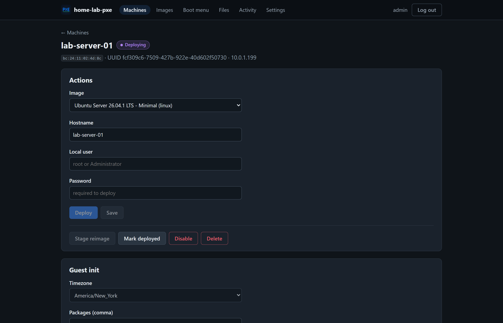
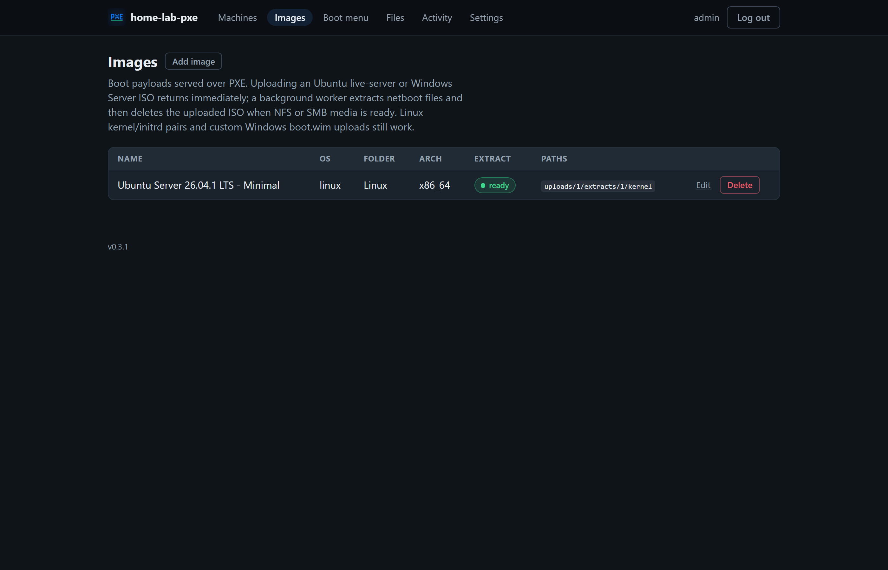
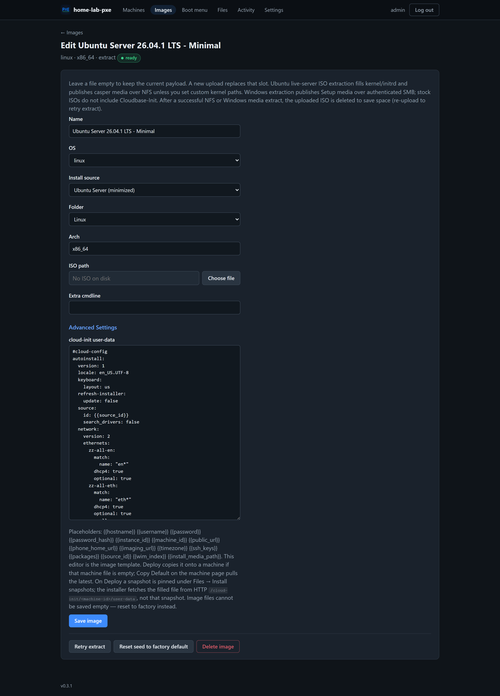
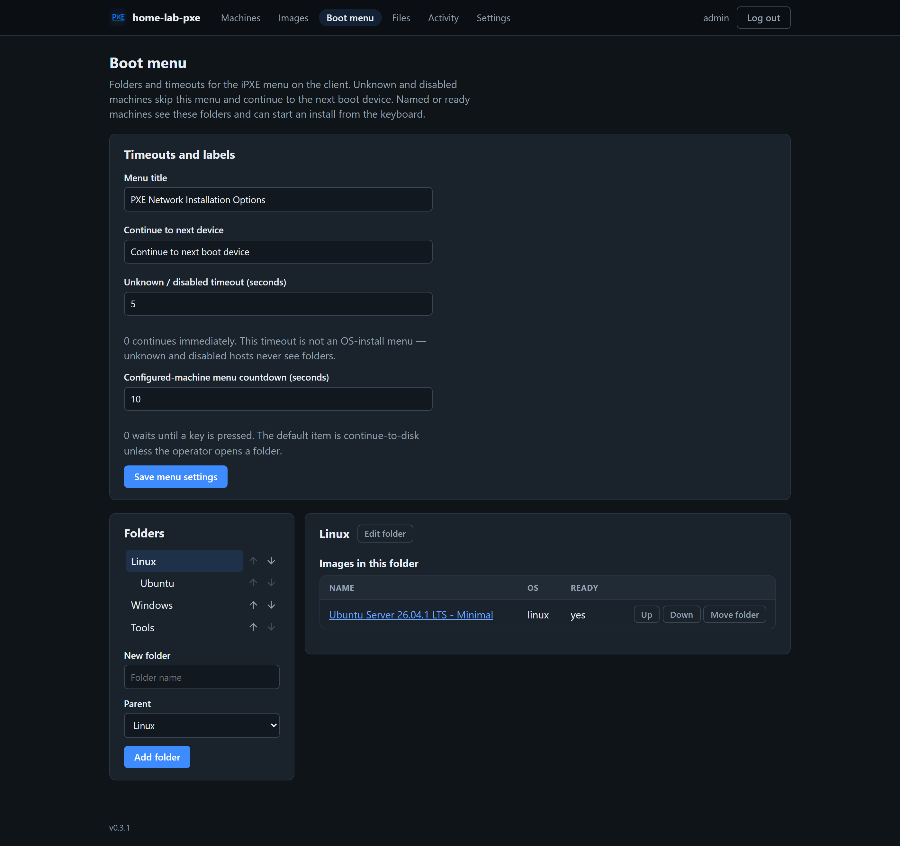
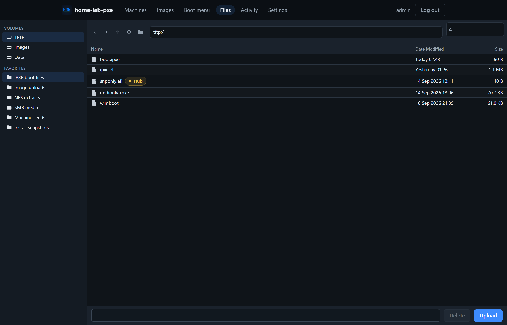
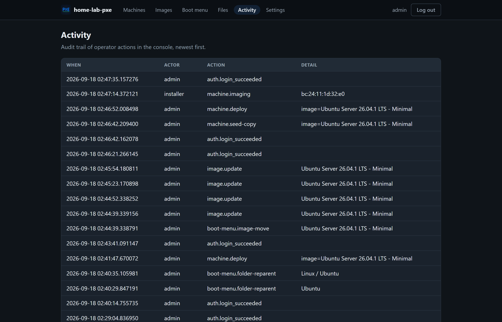
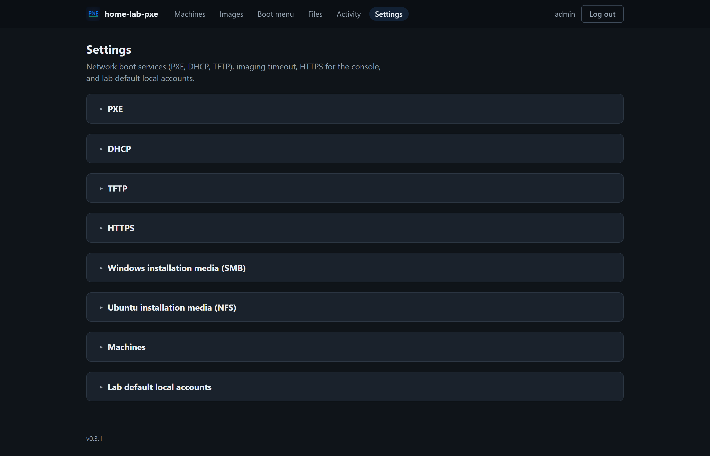

# home-lab-pxe

[License: MIT](LICENSE.md) [Release](VERSION) [Docker](https://hub.docker.com/r/hometinker12/home-lab-pxe) [Python](https://www.python.org/) [AI Assisted](https://cursor.com)

**One-command Docker PXE/iPXE lab.**

**home-lab-pxe** is a self-contained container stack that turns a Linux host into a network boot server with a web console. Deploy with Compose, leave your router handing out IPs, and use the built-in **proxyDHCP** so you do not have to touch the primary DHCP server. Upload a single Ubuntu or Windows ISO, name the machine, pick the image — it installs on the next PXE boot.

Unknown and disabled hosts wait a few seconds, then continue to local disk — they never auto-install. Named hosts see a folder menu (Windows / Linux / Tools) with a countdown back to disk. Linux uses [cloud-init](https://cloudinit.readthedocs.io/) autoinstall. Windows Server uses `unattend.xml` plus [Cloudbase-Init](https://cloudbase.it/cloudbase-init/). Console changes apply on the **next PXE boot**, not as live config management.

## Index

- [At a glance](#at-a-glance)
- [Install](#install)
  - [Get the project](#1-get-the-project)
  - [Create `.env`](#2-create-env)
  - [Create a Fernet key and other secrets](#3-create-a-fernet-key-and-other-secrets)
  - [Start the stack](#4-start-the-stack)
  - [Open the console](#5-open-the-console)
  - [Linux host networking](#6-linux-host-networking-recommended-for-pxe)
  - [Ports](#ports)
- [Environment reference](#environment-reference)
  - [Console and secrets](#console-and-secrets)
  - [Network boot](#network-boot)
  - [Authoritative DHCP](#authoritative-dhcp-only-if-pxe_dhcp_modeauthoritative)
  - [Windows Setup (SMB)](#windows-setup-smb)
  - [Ubuntu live-server (NFS)](#ubuntu-live-server-nfs)
  - [First-boot console defaults](#first-boot-console-defaults)
  - [Paths and size limits](#paths-and-size-limits)
- [User Guide](#user-guide)
  - [How it fits on your LAN](#how-it-fits-on-your-lan)
  - [Machines](#machines)
  - [Images](#images)
  - [Boot menu](#boot-menu)
  - [Files](#files)
  - [Activity](#activity)
  - [Settings](#settings)
  - [Initial Setup](#initial-setup)
- [Documentation](#documentation)
- [License](#license)


## At a glance

**Easy Docker deployment.** One Compose file pulls [hometinker12/home-lab-pxe:latest](https://hub.docker.com/r/hometinker12/home-lab-pxe) and starts the console, iPXE HTTP, dnsmasq (DHCP/TFTP), NFS (Ubuntu), and SMB (Windows).

**proxyDHCP — or your existing DHCP server.** Default mode is proxyDHCP: your router still issues leases; this box only injects PXE next-server and the boot file. Prefer to keep DHCP in one place? Leave the helper off and paste options 60/66/67 from **Settings → PXE** into the server you already run.

**Upload a single ISO.** Drop an Ubuntu live-server or Windows Server ISO in the console. A background worker extracts netboot files, publishes Ubuntu casper over NFS (or Windows Setup over SMB), and deletes the ISO once the media is ready.

**Name it, image it, walk away.** Map a MAC to a hostname and OS in the dashboard. The stack writes [cloud-init](https://cloudinit.readthedocs.io/) / autoinstall for Ubuntu and `unattend.xml` for Windows. The client boots, installs, and phones home — no sitting at the installer.

**Safe by default.** Unknown MACs and disabled hosts never get an install menu. They sleep a few seconds and continue to the next boot device.

## Install

You need [Docker](https://docs.docker.com/get-docker/) and Compose. Real LAN PXE (DHCP, TFTP, NFS, SMB) works best on a **Linux** host. On Windows or macOS Docker Desktop the console still works; network boot to other machines usually does not.

Keep DHCP/TFTP/HTTP-boot on your LAN. Do not publish those ports to the internet.

### 1. Get the project

```powershell
git clone https://github.com/hometinker12/home-lab-pxe.git
cd home-lab-pxe
```


### 2. Create `.env`

```powershell
Copy-Item .env.example .env
```

```bash
cp .env.example .env
```


### 3. Create a Fernet key and other secrets

`ENCRYPTION_KEY` is a [Fernet](https://cryptography.io/en/latest/fernet/) key. The console uses it to encrypt Linux root and Windows Administrator usernames/passwords in SQLite. A random string will not work — it must be a Fernet key.

Install the Python library (once):

```powershell
python -m pip install cryptography
```

Generate a key:

```powershell
python -c "from cryptography.fernet import Fernet; print(Fernet.generate_key().decode())"
```

Open `.env` and replace `replace-with-fernet-key` with the printed value, on one line and with no quotes:

```
ENCRYPTION_KEY=gAAAAABl...the-long-base64-string...=
```

Keep this key. Changing it later makes existing stored passwords unreadable until you set them again in the console.

Generate a session key and replace `change-me-to-a-long-random-string`:

```powershell
python -c "import secrets; print(secrets.token_urlsafe(32))"
```

```
SECRET_KEY=paste-the-output-here
```

Also set:


| Variable             | What to put                                                                                                        |
| -------------------- | ------------------------------------------------------------------------------------------------------------------ |
| `ADMIN_USER`         | Console login name (default `admin`)                                                                               |
| `ADMIN_PASSWORD`     | A strong password you choose                                                                                       |
| `PXE_HOST_LAN_IPV4`  | This computer's LAN IPv4 (not `127.0.0.1`, not a Docker `172.x`)                                                   |
| `PXE_PUBLIC_URL`     | `http://<that-lan-ip>:8080` — keep `http://` so iPXE and guest-init are not blocked by the console TLS certificate |
| `PXE_BIND_INTERFACE` | LAN NIC inside the container (`eth0` is typical)                                                                   |
| `PXE_SMB_PASSWORD`   | Required for Windows Setup media (20–128 URL-safe characters: `A–Z a–z 0–9 . _ - ~`)                               |


### 4. Start the stack

Compose pulls [hometinker12/home-lab-pxe:latest](https://hub.docker.com/r/hometinker12/home-lab-pxe) from Docker Hub.

```powershell
docker compose up -d
```


### 5. Open the console

- HTTP: [http://127.0.0.1:8080/login](http://127.0.0.1:8080/login)
- HTTPS: [https://127.0.0.1:8443/login](https://127.0.0.1:8443/login) (self-signed until you upload a PEM cert under **Settings → HTTPS**)

Sign in with `ADMIN_USER` / `ADMIN_PASSWORD`.

### 6. Linux host networking (recommended for PXE)

Bridge mode is the default and is enough to use the console. For DHCP broadcasts, TFTP, SMB (Windows), and NFS (Ubuntu) on the LAN, add a Compose override on the Linux lab host:

```yaml
# docker-compose.override.yml
services:
  pxe:
    network_mode: host
```

With `network_mode: host`, the `ports:` list is ignored. Keep `PXE_BIND_INTERFACE` on the LAN NIC.

### Ports


| Port            | Use                                              |
| --------------- | ------------------------------------------------ |
| TCP `8080`      | Console, iPXE scripts, cloud-init, Windows seeds |
| TCP `8443`      | HTTPS console                                    |
| UDP `67`        | DHCP                                             |
| UDP `69`        | TFTP (iPXE binaries)                             |
| UDP `4011`      | proxyDHCP                                        |
| TCP/UDP `111`   | rpcbind (Ubuntu NFS)                             |
| TCP/UDP `2049`  | NFS                                              |
| TCP/UDP `20048` | NFS mountd                                       |


Note: Docker Desktop cannot reliably publish host TCP `445` for Windows Setup. Use Linux `network_mode: host` for Windows PXE.

---


## Environment reference

Values in `.env` are **first-boot defaults** for several console settings (DHCP, TFTP, imaging timeout, timezone, boot-menu timeouts). After the first start, change those in the console; they are stored in SQLite. Compose also pins data paths and HTTP/HTTPS ports inside the container.

Copy [.env.example](.env.example) and fill in local values. Never commit `.env`.

### Console and secrets


| Variable         | Default            | Notes                                                                                                        |
| ---------------- | ------------------ | ------------------------------------------------------------------------------------------------------------ |
| `PXE_HTTP_BIND`  | `0.0.0.0`          | Address the HTTP app binds in the container                                                                  |
| `PXE_HTTP_PORT`  | `8080`             | HTTP listen port (Compose also sets this)                                                                    |
| `PXE_HTTPS_PORT` | `8443`             | HTTPS console port                                                                                           |
| `PXE_SSL_DIR`    | `/var/lib/pxe/ssl` | Certificate volume (self-signed on first start)                                                              |
| `SECRET_KEY`     | *(required)*       | Session signing key. Generate a long random string                                                           |
| `ADMIN_USER`     | `admin`            | First console user when the database is empty                                                                |
| `ADMIN_PASSWORD` | *(required)*       | First console password                                                                                       |
| `ENCRYPTION_KEY` | *(required)*       | Fernet key for local-account ciphertext. Create it in [step 3](#3-create-a-fernet-key-and-other-secrets) |


### Network boot


| Variable             | Default                    | Notes                                                                                  |
| -------------------- | -------------------------- | -------------------------------------------------------------------------------------- |
| `PXE_DHCP_MODE`      | `proxy`                    | `proxy` keeps your existing LAN DHCP server. `authoritative` makes this box own leases |
| `PXE_BIND_INTERFACE` | `eth0`                     | NIC dnsmasq uses                                                                       |
| `PXE_PUBLIC_URL`     | `http://192.168.1.10:8080` | URL clients use for iPXE and guest-init. Must be `http://` and the **LAN** address     |
| `PXE_HOST_LAN_IPV4`  | `192.168.1.10`             | Shown in **Settings → PXE**. This computer's LAN IPv4                                  |
| `PXE_ENABLE_DHCP`    | `1`                        | First-boot DHCP helper on/off. After first start, use **Settings → DHCP**              |
| `PXE_ENABLE_TFTP`    | `1`                        | First-boot TFTP on/off. After first start, use **Settings → TFTP**                     |
| `PXE_DHCP_OPTIONAL`  | `1`                        | Allow the container to start even if DHCP bind fails (Compose sets this)               |


### Authoritative DHCP (only if `PXE_DHCP_MODE=authoritative`)


| Variable          | Default                           | Notes                      |
| ----------------- | --------------------------------- | -------------------------- |
| `PXE_DHCP_RANGE`  | `192.168.1.200,192.168.1.250,12h` | Lease range                |
| `PXE_DHCP_ROUTER` | empty                             | Option 3 (default gateway) |
| `PXE_DHCP_DNS`    | empty                             | Option 6                   |


proxyDHCP does not use range/router/DNS. Those fields stay on your existing DHCP server.

### Windows Setup (SMB)


| Variable           | Default                    | Notes                                                                  |
| ------------------ | -------------------------- | ---------------------------------------------------------------------- |
| `PXE_SMB_USER`     | `pxemedia`                 | 1–32 letters, digits, `.`, `_`, or `-`                                 |
| `PXE_SMB_PASSWORD` | *(set this)*               | 20–128 URL-safe characters. WinPE maps the read-only `pxe-media` share |
| `PXE_SMB_HOST`     | host from `PXE_PUBLIC_URL` | Override if SMB should be advertised on a different address            |


### Ubuntu live-server (NFS)


| Variable         | Default                   | Notes                                           |
| ---------------- | ------------------------- | ----------------------------------------------- |
| `PXE_NFS_HOST`   | same as `PXE_SMB_HOST`    | Address clients use for `nfsroot=`              |
| `PXE_NFS_EXPORT` | `/var/lib/pxe/images/nfs` | Parent of per-image extract paths `/{id}/{rev}` |


Each successful Ubuntu ISO extract becomes its own NFS export so casper can mount squashfs instead of downloading the ISO into RAM.

### First-boot console defaults

After first start, edit these in the UI instead of `.env`.


| Variable                           | Default | Where it lands                                                     |
| ---------------------------------- | ------- | ------------------------------------------------------------------ |
| `PXE_IMAGING_TIMEOUT_MINUTES`      | `15`    | **Settings → Machines**. `0` disables the timer                    |
| `PXE_DEFAULT_TIMEZONE`             | `UTC`   | **Settings → Machines**. New and discovered hosts inherit this     |
| `PXE_UNKNOWN_BOOT_TIMEOUT_SECONDS` | `5`     | **Boot menu**. Unknown/disabled continue to disk. `0` is immediate |
| `PXE_MENU_TIMEOUT_SECONDS`         | `10`    | **Boot menu**. Named-host countdown. `0` waits for a key           |


### Paths and size limits

Compose already sets the path variables to the named volumes. Leave them unless you change the Compose file.


| Variable                      | Default                              | Notes                                                          |
| ----------------------------- | ------------------------------------ | -------------------------------------------------------------- |
| `PXE_TFTP_ROOT`               | `/var/lib/pxe/tftp`                  | iPXE binaries                                                  |
| `PXE_IMAGE_ROOT`              | `/var/lib/pxe/images`                | Uploads, NFS extracts, SMB media                               |
| `PXE_DATA_DIR`                | `/var/lib/pxe/data`                  | SQLite, seeds, settings                                        |
| `PXE_DATABASE_URL`            | `sqlite:////var/lib/pxe/data/pxe.db` | Inventory database                                             |
| `PXE_MAX_UPLOAD_BYTES`        | `8589934592` (8 GiB)                 | Single kernel/initrd/WIM/ISO/TFTP upload                       |
| `PXE_MAX_SEED_BYTES`          | `1048576` (1 MiB)                    | Editable cloud-init / unattend file                            |
| `PXE_MAX_EXTRACT_BYTES`       | `21474836480` (20 GiB)               | Uncompressed Windows media or Ubuntu casper+dists+pool extract |
| `PXE_EXTRACT_TIMEOUT_SECONDS` | `3600`                               | Background ISO extract timeout                                 |
| `PXE_7Z_BIN`                  | first of `7z`, `7zz`, `7za` on PATH  | Optional override for 7-Zip                                    |


Do not set `PXE_ALLOW_INSECURE_DEFAULTS` outside tests. It is not a production option.

---

## User Guide

Sign in, then use the header tabs. Changes you save are staged for the **next PXE boot**.



### How it fits on your LAN

Your existing DHCP server stays authoritative. This container answers the PXE half of the conversation:

```text
[ Target machine ]
      |-- (1) DHCP lease     -->  existing router / DHCP   (IP, gateway, DNS)
      |-- (2) PXE / proxyDHCP -->  home-lab-pxe dnsmasq    (next-server + iPXE filename)
      |-- (3) TFTP            -->  undionly.kpxe / ipxe.efi / boot.ipxe
      '-- (4) HTTP (+ NFS/SMB) --> iPXE menu, kernel/initrd, cloud-init / unattend,
                                   Ubuntu casper over NFS, Windows Setup over SMB
```

| Piece | Role |
|---|---|
| **dnsmasq (proxyDHCP)** | Sees PXE discovery, points the NIC at the iPXE bootloader. Does not own LAN leases |
| **TFTP** | Stage-1 files: `undionly.kpxe` (BIOS), `ipxe.efi` (UEFI), `boot.ipxe` if the client is already iPXE |
| **HTTP (FastAPI)** | Console UI, per-MAC iPXE scripts, kernels, cloud-init, Windows seeds — faster than TFTP for the large payloads |
| **NFS** | Ubuntu live-server casper extract (`netboot=nfs`) so the installer does not have to download the whole ISO into RAM |
| **SMB** | Authenticated read-only Windows Setup media (Linux `network_mode: host`) |
| **SQLite** | Machine inventory and Fernet-encrypted local-account credentials |

Prefer diagrams and security notes? See [`ARCHITECTURE.md`](ARCHITECTURE.md).

### Machines

Inventory of every host that has checked in over PXE (or that you added by MAC). Status is **Deploying**, **Imaging**, **Deployed**, **Disabled**, or **Timeout Error**.

- **Add machine** registers a MAC before it boots. Unknown MACs still appear after the first iPXE check-in.
- **Refresh** reloads status without leaving the page.
- **Delete** removes the record. The next boot with that MAC registers as unknown again.
- Unknown and disabled hosts skip the install menu and continue to local disk after the Boot menu timeout.
- Named / ready / deployed hosts (with no install in progress) see the folder menu.



Open a host to name it, choose an image, set the local account, edit guest-init, and **Deploy**. Deploy saves the form and copies the image's cloud-init / unattend template onto the machine if that file is still empty. **Copy Default** refreshes it from the image. **Stage reimage** queues a new image for the next PXE boot of an already-deployed host.

If Imaging runs past the timeout in **Settings → Machines** (default 15 minutes), the host becomes **Timeout Error**. Deploy again to retry.



### Images

Upload an Ubuntu live-server or Windows Server ISO (or a kernel/initrd / `boot.wim` pair). The add dialog returns immediately; a background worker extracts netboot files. After a successful NFS (Ubuntu) or SMB (Windows) extract, the uploaded ISO is deleted.

Each image lives in a Boot menu folder. **Edit** is disabled while extract is queued or running. After extract, **Install source** lists Ubuntu IDs (from `casper/install-sources.yaml`) or Windows editions (from `install.wim`). In cloud-init and unattend templates, the `{{source_id}}` placeholder is replaced with the install source you pick here.

Tool images boot from the client menu without changing machine state.





### Boot menu

This is the nested iPXE menu the client sees: default folders are Windows, Linux, and Tools. Set the menu title, the “continue to disk” label, and the two timeouts. Reorder folders, nest them, and move images between folders. The last remaining folder cannot be deleted. Each image must belong to a folder.



### Files

A file manager for the TFTP, Images, and Data volumes (list, upload, download, delete). Favorites jump to iPXE binaries, image uploads, NFS extracts, SMB media, and machine seeds. Paths stay inside those volume roots.



### Activity

Operator audit trail, newest first (logins, deploys, image edits, folder moves).



### Settings

PXE, DHCP, TFTP, HTTPS, Windows SMB, Ubuntu NFS, machine defaults, and lab local accounts.



| Section | What it is for |
|---|---|
| **PXE** | Host LAN IPv4, advertised `http://<lan>:8080/boot.ipxe`, bind interface, extra dnsmasq lines, and copy-paste DHCP options 60 (`PXEClient`), 66 (next-server), and 67 (boot file) for an *external* DHCP server. Leave 60/66/67 unset on the other server if this box is already running proxyDHCP |
| **DHCP** | Enable/disable the helper. **proxyDHCP** (default) only answers PXE; your router still hands out leases. **authoritative** owns the range |
| **TFTP** | First-stage iPXE binaries (`undionly.kpxe`, `ipxe.efi`, `boot.ipxe`, …). Disable if another server already hosts them |
| **HTTPS** | Console TLS. Replace the first-boot self-signed cert with a PEM cert + key, or regenerate. iPXE and guest-init stay on HTTP |
| **Windows installation media (SMB)** | Read-only `pxe-media` share. Password comes from `PXE_SMB_PASSWORD`. Stock Windows ISOs do not include Cloudbase-Init |
| **Ubuntu installation media (NFS)** | Per-extract casper exports. Autoinstall answers come from HTTP `/cloud-init/{machine}/user-data` at install time |
| **Machines** | Imaging timeout and default IANA timezone for new hosts |
| **Lab default local accounts** | Encrypted Linux root and Windows Administrator defaults. Passwords are write-only |

### Initial Setup

1. Sign in and open **Settings → Lab default local accounts**. Set Linux and/or Windows passwords.
2. Confirm **Settings → PXE** shows your LAN IPv4. Leave DHCP on **proxyDHCP** unless this box should own leases.
3. **Images → Add image**, name it, choose Linux or Windows, pick a folder, upload the ISO. Wait until Extract is **ready**.
4. PXE-boot a machine. It appears under **Machines** as unknown and continues to disk after a few seconds.
5. Open the machine, set a hostname, then **Deploy** (or let the named host pick the image from the iPXE folder menu on the next boot).
6. Watch state move **Deploying → Imaging → Deployed**. Activity records operator and installer events.

---

## Documentation

- [`ARCHITECTURE.md`](ARCHITECTURE.md) — container, console, and security diagrams
- [`PLAN.md`](PLAN.md) — architecture and implementation plan
- [`CONTRIBUTING.md`](CONTRIBUTING.md) — setup, tests, PR expectations
- [`SECURITY.md`](SECURITY.md) — private vulnerability reporting
- [`CHANGELOG.md`](CHANGELOG.md) — user-visible changes
- [`.env.example`](.env.example) — environment variable template

## License

MIT. See [`LICENSE.md`](LICENSE.md).

